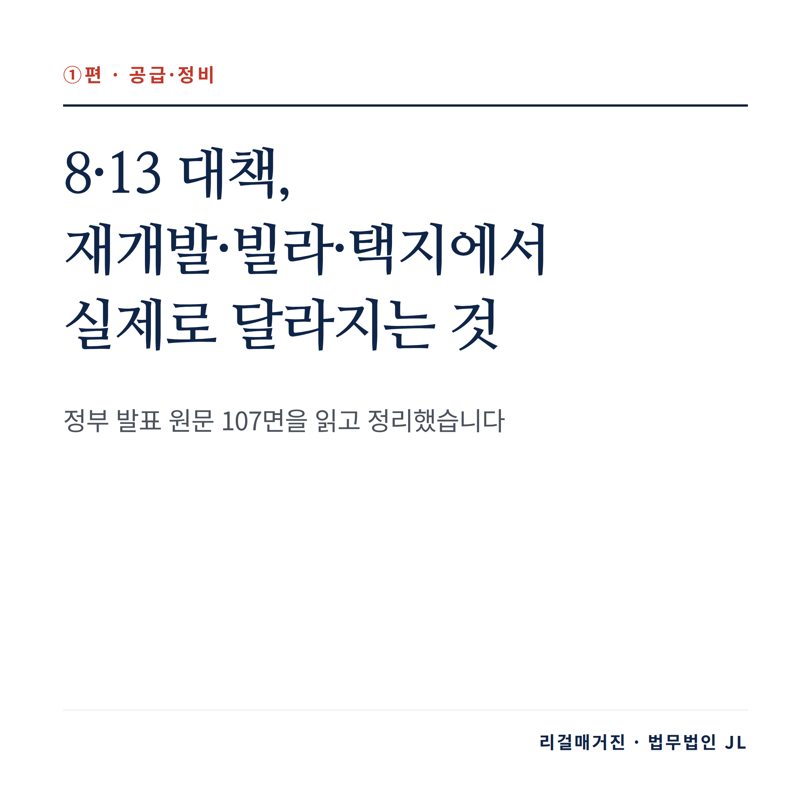
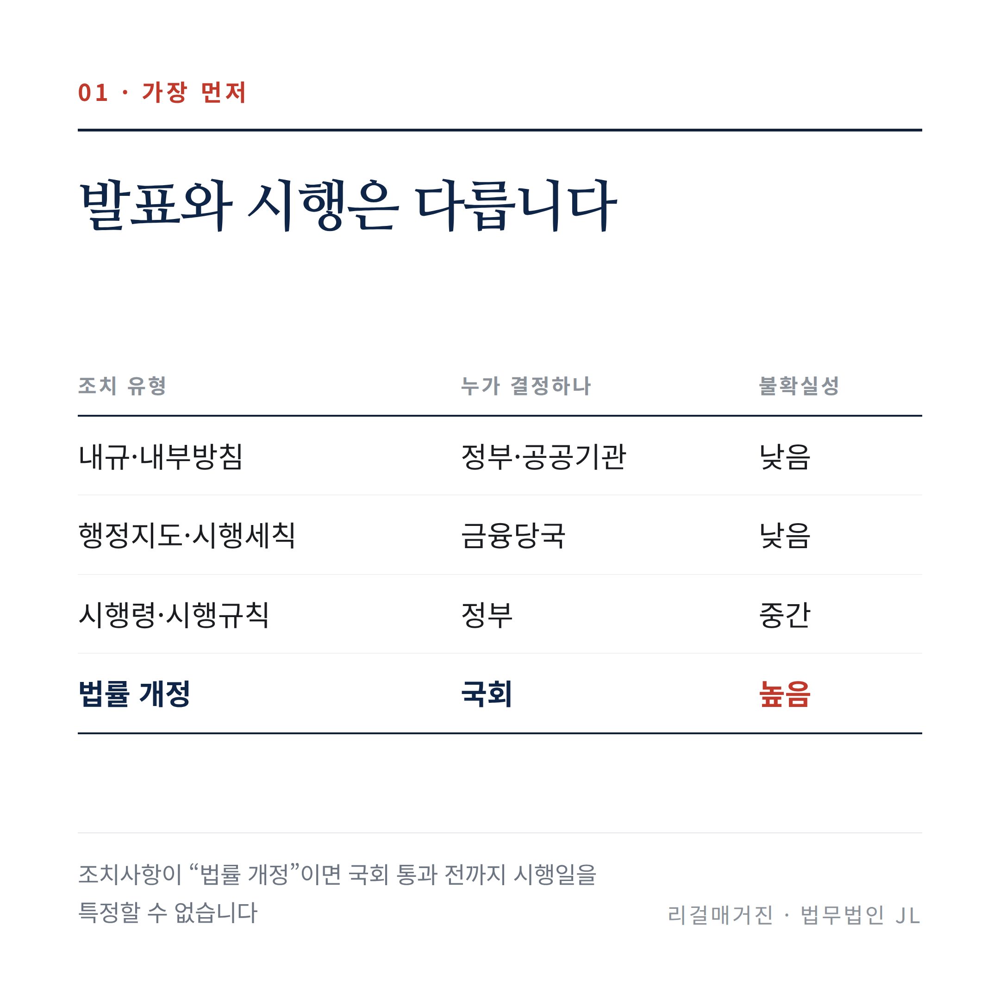
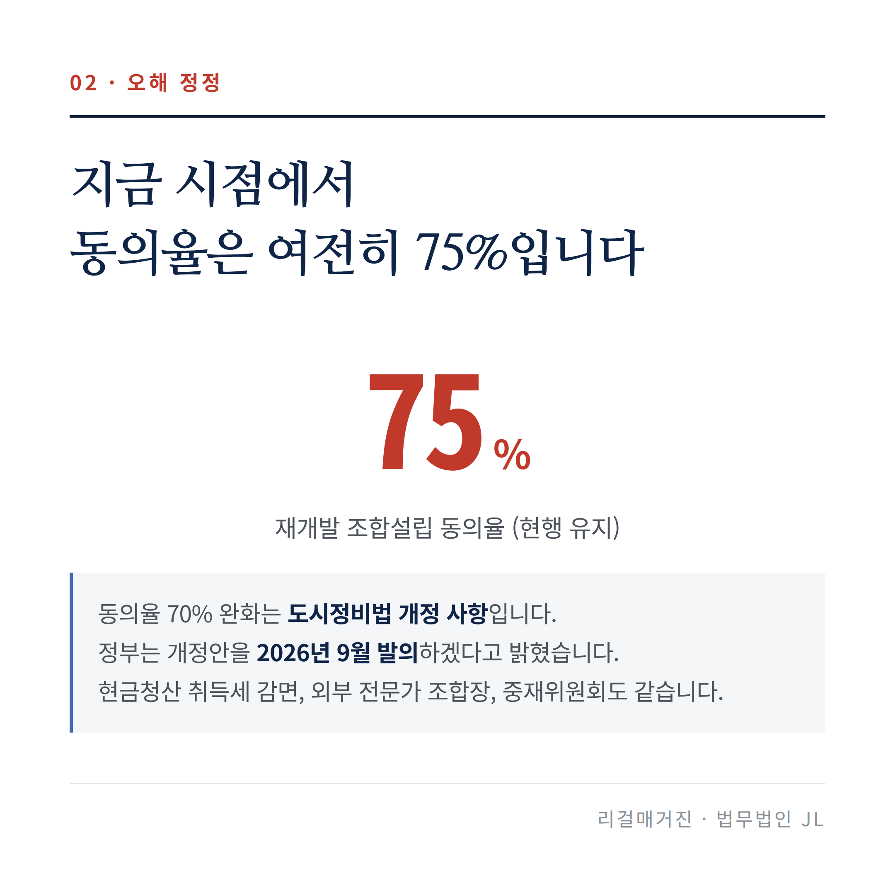
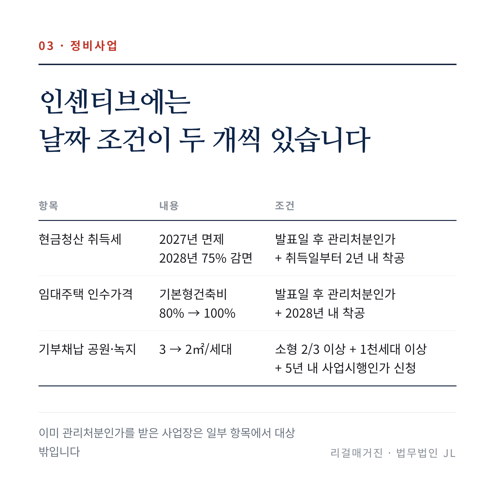
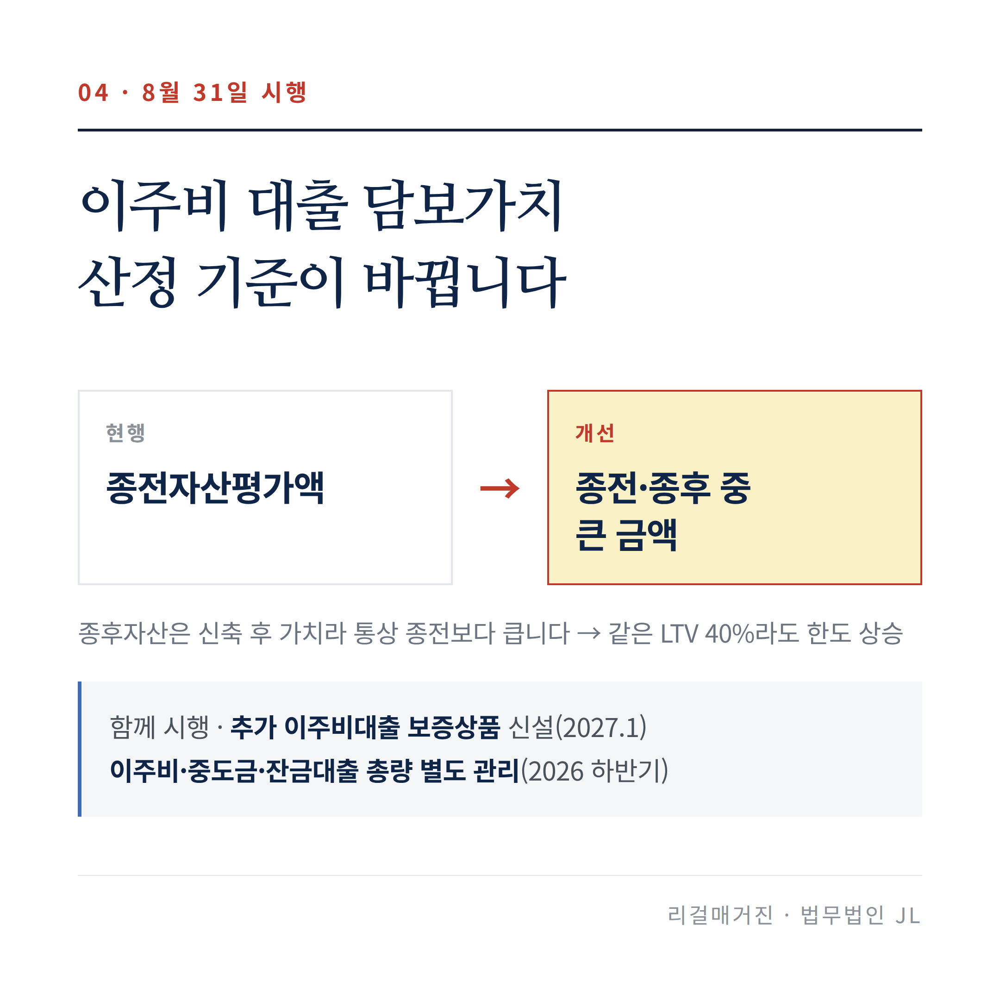
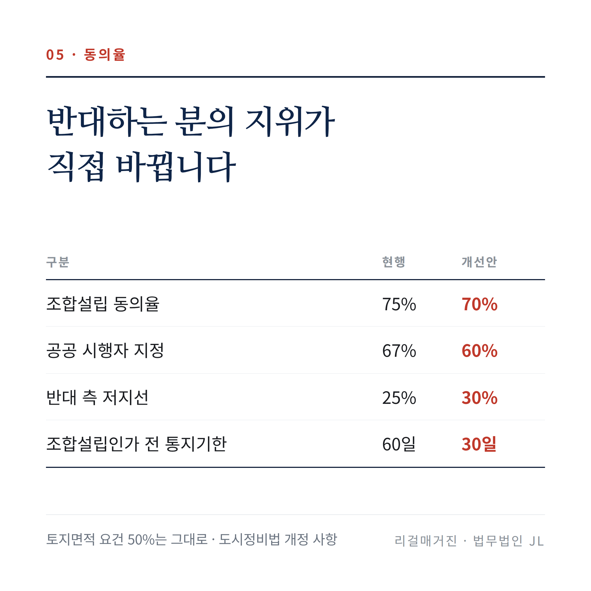
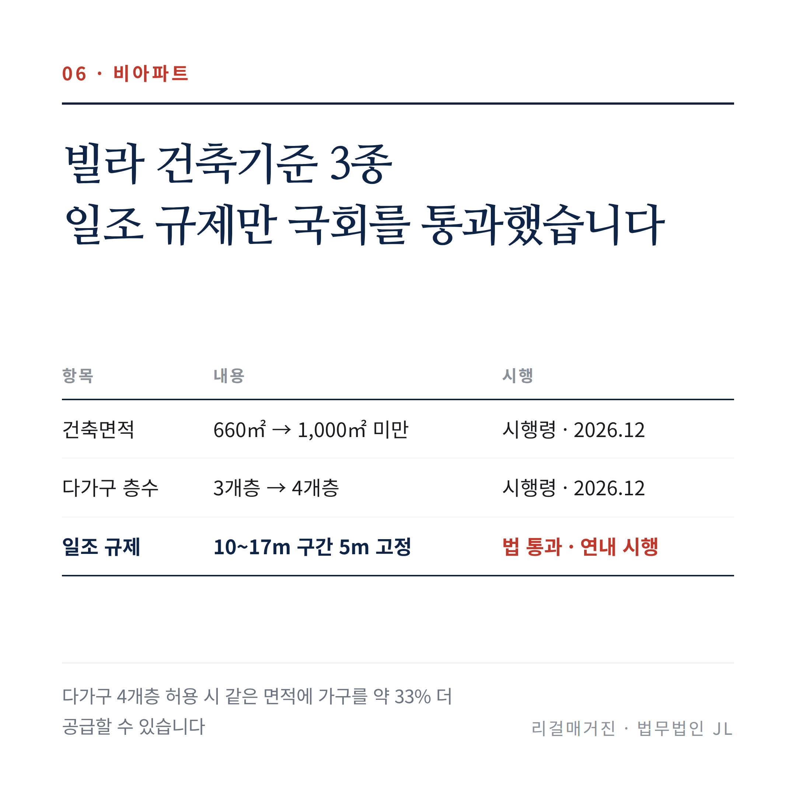
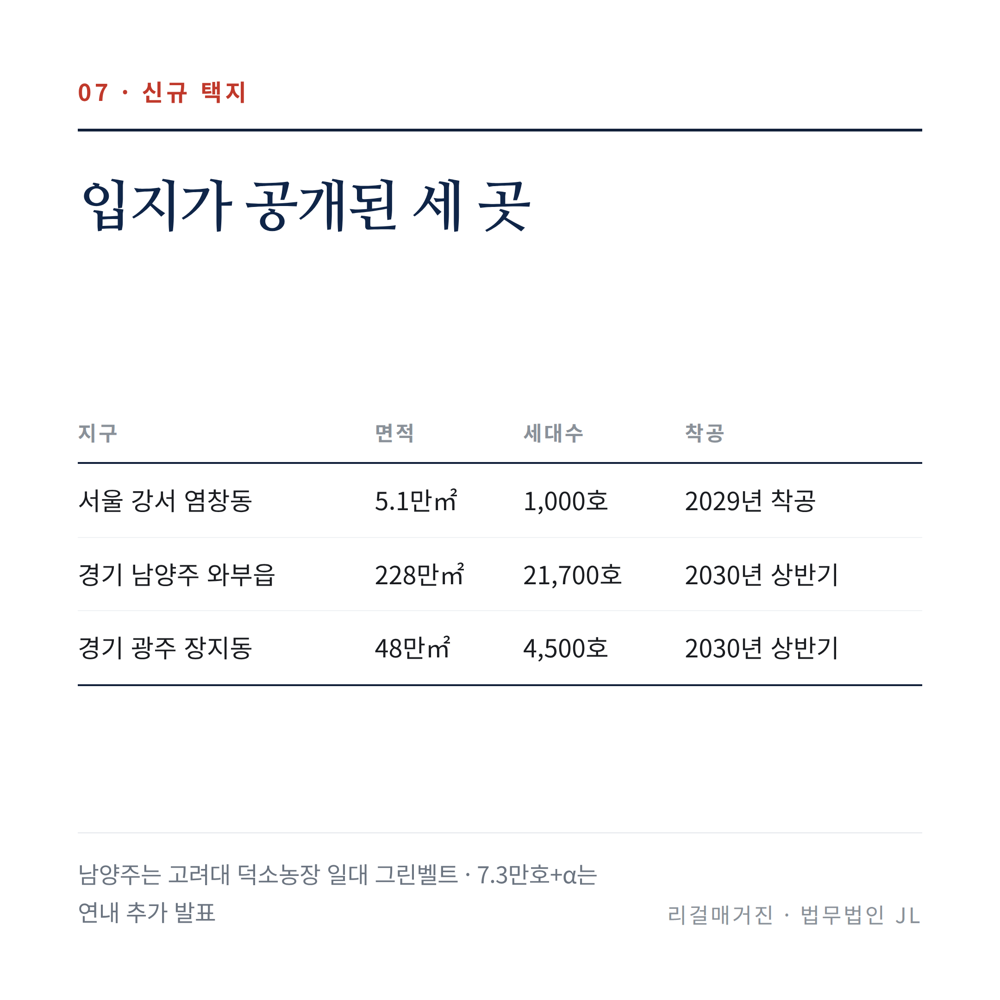
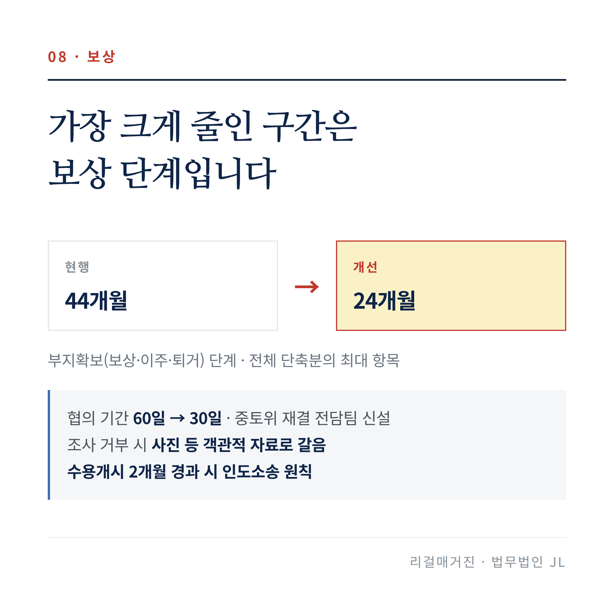
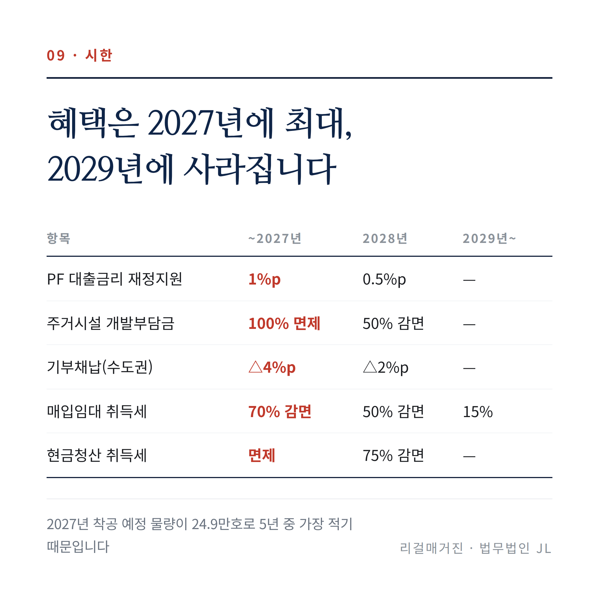

# 8·13 대책, 재개발·빌라·택지에서 실제로 달라지는 것

> 법무법인 JL이 2026년 8월 13일 정부 발표 원문 107면을 모두 읽고 정리했습니다.
> 이번 글은 **재개발·재건축 조합원, 비아파트 사업자, 신규 택지 편입 토지주**를 위한 편입니다.
> 청년 대출과 전세대출은 **②금융·대출 편**에서 따로 다룹니다.

지난 8월 13일 정부가 「전월세 및 매매시장 안정을 위한 주택 신속공급 방안」(국토교통부)과 「부동산 시장 안정을 위한 금융 종합대책」(금융위원회)을 함께 발표했습니다. 수도권에 23만호를 더 공급하고, 재개발 동의율을 낮추고, 빌라를 4층까지 지을 수 있게 하겠다는 내용이 하루 만에 쏟아졌습니다.

그런데 상담을 받다 보면 같은 질문이 반복됩니다. **"그래서 지금 되는 건가요?"**

결론부터 말씀드리면, 이번 발표에서 **당장 효력이 생긴 것은 많지 않습니다.** 크게 다뤄진 항목일수록 오히려 국회에서 법을 고쳐야 합니다.

---

## 1. 가장 먼저 알아야 할 것 — '발표'와 '시행'은 다릅니다

정부 대책 문서에는 과제마다 '조치사항'이 적혀 있습니다. 이 조치사항이 무엇이냐에 따라 실제 시행까지 걸리는 시간이 완전히 달라집니다.

| 조치 유형 | 누가 결정하나 | 불확실성 | 이번 대책의 예 |
|---|---|---|---|
| 내규·내부방침 | 정부·공공기관 | 낮음 | PF 보증비율 확대, LH 택지 회수 방침 |
| 행정지도·시행세칙 | 금융당국 | 낮음 | 이주비 대출 기준, 임대사업자 대출 예외 |
| 시행령·시행규칙 | 정부 | 중간 | 다세대·다가구 건축기준, 주상복합 주거비율 |
| **법률 개정** | **국회** | **높음** | **재개발 동의율, 취득세 감면, 전문 조합장** |

기사 제목으로 가장 많이 나온 **재개발 조합설립 동의율 75% → 70%**와 **현금청산 부동산 취득세 감면**은 전부 마지막 줄에 해당합니다. 도시정비법·지방세특례제한법을 고쳐야 하고, 정부는 개정안을 2026년 9월에 발의하겠다고 적었습니다.

즉 **지금 시점에서 동의율은 여전히 75%입니다.**

이 글에서는 각 항목마다 근거가 법률인지 아닌지를 함께 표시하겠습니다.

---

## 2. 재개발·재건축 조합원이라면

### 인센티브에는 날짜 조건이 두 개씩 걸려 있습니다

이번 인센티브는 "빨리 착공하면 준다"가 아닙니다. **"대책 발표일(8월 13일) 이후에 관리처분인가를 받고, 정해진 기한 안에 착공하면 준다"**는 이중 조건입니다.

| 항목 | 내용 | 조건 |
|---|---|---|
| 현금청산 부동산 취득세 | 2027년 취득분 면제 / 2028년 취득분 75% 감면 | 발표일 후 관리처분인가 + 취득일부터 **2년 내 착공** |
| 공공기여 임대주택 인수가격 | 기본형건축비 80% → 100% | 발표일 후 관리처분인가 + **2028년 내 착공** |
| 기부채납 공원·녹지 | 3 → 2㎡/세대 | 세대수 2/3 이상이 전용 60㎡ 이하 + 1천세대 이상 + **5년 내 사업시행인가 신청** |
| PF 대출보증 한도 | 총사업비 60% | 특례 **2027년까지 1년 연장** |

**이미 관리처분인가를 받은 사업장은 일부 항목에서 아예 대상 밖입니다.** 기부채납 완화도 "발표일 전 사업인가를 득했거나 신청한 곳은 제외"로 명시돼 있습니다.

조합에서 먼저 확인하실 것은 혜택의 크기가 아니라 **우리 사업장의 관리처분인가 예정일이 8월 13일 이후인지, 그리고 착공 시한을 물리적으로 맞출 수 있는지**입니다. 위 표의 취득세·인수가격은 각각 지방세특례제한법·도시정비법 개정 사항입니다.

### 이주비 대출은 이미 바뀌었습니다 — 8월 31일

이 편에서 **국회를 거치지 않고 곧바로 효력이 생기는 유일한 항목**입니다.

지금까지 이주비 대출의 담보가치는 '종전자산평가액', 즉 헐기 전 내 집의 가치를 기준으로 계산했습니다. 이것이 **'종전자산평가액과 종후자산평가액 중 큰 금액'**으로 바뀝니다. 종후자산은 새로 지어질 집의 추산 가치이므로 보통 종전보다 큽니다. 같은 LTV 40%라도 **실제 대출 가능액이 올라갑니다.**

여기에 두 가지가 더 붙습니다.

- 이주비만으로 부족한 경우를 위한 **추가 이주비대출 보증상품** 신설 (주택금융공사, 2027년 1월)
- 이주비·중도금·잔금대출을 은행 **대출 총량 관리에서 별도로 관리** (2026년 하반기)

연말이면 이주비 대출 창구가 닫히던 문제를 겨냥한 조치입니다. 이주 일정을 짜실 때 반영하시기 바랍니다.

### 동의율 완화는 반대하는 분의 지위를 직접 바꿉니다

재개발 조합설립 동의율이 **75% → 70%**로, 공공재개발·재건축 시행자 지정 동의율이 **67% → 60%**로 낮아집니다. 토지면적 요건 50%는 그대로 두고 인원 요건만 낮춘 것입니다.

실무적으로는 그동안 동의율 미달로 멈춰 있던 구역이 조합설립 요건을 채우게 되는 효과가 큽니다. 반대로 **반대하시는 분 입장에서는 저지선이 25%에서 30%로 올라갑니다.** 여기에 조합설립인가 신청 전 토지등소유자 통지기한이 **60일 → 30일**로 줄어, 통지를 받고 대응을 검토할 시간도 절반이 됩니다.

다만 다시 말씀드리지만 **도시정비법 개정 사항**입니다. 국회 통과 시점이 실제 적용일입니다.

### 눈여겨볼 조항 두 가지

**① 외부 전문가가 재개발 조합장을 맡을 수 있게 됩니다.** 조합장은 토지등소유자여야 한다는 원칙에 대한 예외를 재개발에 한해 여는 것으로, 정비사업 업무에 5년 이상 종사한 변호사·공인회계사·법무사 등이 예시로 적혔습니다. 같은 조문에서 조합임원 성과급 지급 근거가 마련되고, 조합장이 정당한 사유 없이 총회를 소집하지 않으면 과태료가 부과됩니다.

**② 시공사가 자재 물량·단가 세부내역을 제출해야 합니다.** 시공사 선정 후 일정기간(예: 3개월) 내에 제출하지 않으면 과태료가 부과됩니다. 공사비 증액 분쟁을 사전에 막는 데 실질적인 도움이 되는 조항입니다. **시공사 선정 공고와 계약서에 제출 시한과 미제출 시 효과를 미리 명시해 두시길 권합니다.**

국토부 안에 확정판결의 효력을 갖는 정비사업 전문 중재기구를 두겠다는 내용도 있습니다. 다만 원문 표현이 "신설하는 등 신속한 분쟁 해소방안 **검토**"로, 아직 확정 단계가 아닙니다. 현 시점에서 분쟁 대응 전략을 중재기구 전제로 짜는 것은 이릅니다.

### 참고로, 서울시가 요구한 조합원 지위양도 제한 완화는 빠졌습니다

이주비 대출 완화는 반영됐지만 지위양도 항목은 이번 대책에 들어가지 않았습니다. 정비구역 내 매매를 검토하신다면 **종전 규제가 그대로 유지된다**는 전제로 판단하셔야 합니다.

---

## 3. 빌라·오피스텔을 짓거나 사려면

수도권 일반주택(비아파트) 착공은 10년 평균의 24% 수준까지 떨어져 있습니다. 서울 20~30대 가구의 67.9%가 비아파트에 살고 있는데 신축이 끊긴 상황입니다. 정부가 건축기준을 여러 개 풀었습니다.

- 다세대·다가구 **건축면적 660㎡ → 1,000㎡ 미만** (공용부가 효율화되어 전용면적이 늘어남)
- 다가구 **층수 3개층 → 4개층** (같은 면적에 가구를 약 **33%** 더 공급 가능)
- **일조 규제 완화** — 10~17m 구간의 이격거리를 5m로 고정해, 4~5층 부분을 사선이 아닌 수직으로 건축

이 중 **일조 규제만 이미 국회를 통과했습니다.** 7월 23일 건축법 개정안이 본회의를 통과해 하위법령을 만든 뒤 연내 시행 예정입니다. 정부는 특히 **용적률 상한을 채우지 않고 지어진 노후 단독주택 대지**에서 증축·재건축 효과가 클 것으로 봅니다.

나머지는 건축법 시행령 개정 사항으로 2026년 12월 예정입니다. 별도로 도시형생활주택으로 다세대를 짓는 경우 건축위 심의를 거쳐 5 → 6개층까지 완화하는 주택법 시행령 개정이 9월까지 진행 중입니다.

### 사업자 대출길이 열립니다 — 8월 31일

수도권·규제지역에서 주택매매·임대사업자의 주택담보대출은 원칙적으로 금지(LTV 0%)였습니다. 여기에 예외 두 가지가 추가됩니다.

| 예외 사유 | LTV | 한정 조건 |
|---|---|---|
| 신축 비아파트 매입 | 규제지역 30% / 비규제지역 60% (등록임대사업자는 지역 무관 60%) | 해당 건물 **준공 후 1년 내 최초** 매수자 |
| 비아파트 신축 목적 멸실예정 주택 매입 | **60%** (지역 무관) | 대출 실행일로부터 **1년 내 멸실** |

행정지도 개정 사항이라 국회와 무관하게 시행됩니다. 다만 **두 예외 모두 1년이라는 기한 조건**이 붙고, 조건을 못 지켰을 때의 효과는 원문에 적혀 있지 않습니다. 대출 실행 전에 금융회사 약정 조건을 반드시 확인하시기 바랍니다.

### 세제와 부담금

**소형 신축주택 주택수 제외 특례**가 2027년 12월 → **2028년 12월**로 1년 연장됩니다. 전용 60㎡ 이하이면서 취득가격이 수도권 6억·지방 3억원 이하인 신축주택을 그 기간에 처음 사면, 취득세·종부세·양도세를 매길 때 주택수에서 빠집니다. 아파트는 제외되지만 도시형 생활주택인 아파트는 포함됩니다.

**주택신축판매업자**(20호 미만 소규모 공급자)의 취득세 중과배제 요건도 완화됩니다. 1년 내 멸실·3년 내 신축은 그대로지만 **판매 기한이 5년 → 7년**으로 늘어납니다.

여기에 **2027년까지 착공하는 전국 주거시설은 개발부담금이 100% 면제**되고(2028년 착공은 50% 감면), 수도권에서 2027년까지 사업계획승인을 받으면 기반시설 기부채납 부담률이 8% → 4%로 줄어듭니다(2028년은 6%). 다만 기부채납·개발부담금은 착공이 아니라 **사업계획승인**이 기준이고, 승인 후 1년 내 착공한 경우에만 적용됩니다.

세제 항목은 2027년 2월 전후 시행령·특례 개정 사항입니다.

---

## 4. 신규 택지에 땅이 있다면

이번에 입지가 공개된 곳은 세 곳입니다.

| 지구 | 면적 | 세대수 | 일정 |
|---|---|---|---|
| 서울 강서구 염창동 | 5.1만㎡ | 1,000호 | 발표 후 33개월, 2029년 착공 |
| 경기 남양주시 와부읍 | 228만㎡ | 21,700호 | 2027년 하반기 지구지정 → 2030년 상반기 착공 |
| 경기 광주시 장지동 | 48만㎡ | 4,500호 | 2027년 하반기 지구지정 → 2030년 상반기 착공 |

남양주는 고려대 덕소농장 일대 그린벨트입니다. 나머지 **7.3만호 이상은 연내 추가 발표**됩니다.

### 물량보다 중요한 것은 절차입니다

정부는 택지 발표부터 착공까지의 기간을 68개월에서 37개월로 줄이겠다고 했습니다. 그런데 **가장 크게 줄인 구간이 보상 단계(44 → 24개월)**이고, 그 수단은 다음과 같습니다.

- 협의 기간 **60일 → 30일**로 단축
- 중앙토지수용위원회 재결 전담팀 신설
- 기본조사를 거부하면 **사진 등 객관적 자료로 갈음** (토지보상법 개정 필요)
- 퇴거 지연 시 이행강제금, **수용개시 2개월 경과 시 인도소송 원칙**

한마디로 **협의할 수 있는 시간이 절반으로 줄고, 조사를 거부할 실익이 사라지며, 퇴거가 늦어지면 소송이 따라붙는** 구조입니다. 남양주 도심은 2029년 하반기 보상 완료 일정이 이미 문서에 명시돼 있습니다. **감정평가가 시작되기 전 단계부터 준비 기간을 앞당겨 잡으셔야 합니다.**

### 토지거래허가구역이 넓게 걸렸습니다

발표된 지구와 주변(남양주 도곡·월문·덕소리, 광주 장지·양벌·역동)은 **발표일로부터 5년간** 토지거래허가구역입니다. 여기에 더해 나머지 후보지가 발표될 때까지 **서울 그린벨트 전역과 서울 인접 수도권 그린벨트**도 한시 지정됐습니다.

다만 정부는 "신규택지 발표 시 사업별 영향 범위를 고려하여 **제외지역은 즉시 해제**"한다고 밝혔습니다. 연내 후보지 발표 시점이 곧 광범위한 해제 시점이기도 합니다.

투기 방지 조치도 함께 시행됩니다. 최근 5년간 거래 2,803건 중 **이상거래 1,179건**을 선별해 자금조달내역을 분석하고, 불법 의심 거래는 경찰청에 수사 의뢰합니다. 지구 내 토지는 주민 의견청취 공고 즉시 건축·형질변경·분할 등 개발행위가 제한됩니다.

---

## 5. 이번 대책의 진짜 설계 — 2027년이라는 절벽

개별 항목을 따로 보면 잘 안 보이는데, 시한만 한자리에 모으면 같은 형태가 반복됩니다.

| 항목 | ~2027년 | 2028년 | 2029년~ |
|---|---|---|---|
| PF 대출금리 재정지원 | **1%p** | 0.5%p | — |
| 주거시설 개발부담금 | **100% 면제** | 50% 감면 | — |
| 기반시설 기부채납(수도권) | **△4%p** | △2%p | — |
| 매입임대 건설사업자 취득세 | **70% 감면** | 50% 감면 | 15% |
| 현금청산 부동산 취득세 | **면제** | 75% 감면 | — |
| PF보증 공급목표 | **33조원** | 30조원 | — |

**혜택이 2027년에 최대이고, 2028년에 대체로 절반으로 줄며, 2029년에는 사라집니다.**

이유는 정부 문서에 그대로 적혀 있습니다. **2027년 착공 예정 물량이 24.9만호로 5년 중 가장 적기 때문**입니다(2026년 26.8 / 2028년 26.2 / 2029년 26.3 / 2030년 34.3만호). 그 골을 메우려고 자원을 2027년에 몰아넣은 것입니다.

문제는 이 시한이 걸린 세제 항목들이 **국회 통과를 전제로 한다**는 점입니다. 개정이 늦어지면 시한은 그대로인 채 적용 가능 기간만 짧아집니다. 매입임대 감면율에 대해 정부 스스로 "적용시기는 국회 논의과정에서 추가 검토"라고 부기한 이유입니다.

---

## 6. 자주 나오는 오해 두 가지

**"재개발 동의율이 70%로 낮아졌다?"**
아직 아닙니다. 도시정비법을 고쳐야 하고 개정안은 2026년 9월 발의 예정입니다. 국회를 통과하기 전까지는 **75%입니다.** 현금청산 취득세 감면, 외부 전문가 조합장, 중재위원회도 모두 마찬가지입니다.

**"이제 택지 발표 후 37개월이면 착공한다?"**
조건부입니다. 정부 문서의 각주에 **"전략환경영향평가 간소화 법 개정 전제(본회의 상정 대기 중), 미개정 시 7개월 추가 소요"**라고 적혀 있습니다. 개정이 안 되면 **44개월**입니다. 정확하게는 "법 개정 완료 시 37개월, 미개정 시 44개월"로 이해하셔야 합니다.

---

## 정리하면

개별 사안에서 확인하실 것은 결국 두 가지로 좁혀집니다.

1. **내가 받으려는 혜택의 근거가 법률 개정인가, 아니면 행정지도·내규인가**
2. **우리 사업장이나 내 계약이 그 시한 안에 들어가는가**

법률 개정 항목은 국회 통과 전까지 시행일을 특정할 수 없습니다. 반대로 행정지도·내규·시행세칙으로 처리되는 항목(이주비 대출 기준, 임대사업자 대출 예외, PF 보증비율)은 예정일에 시행될 가능성이 높습니다. **이 구분만 잡아도 불필요한 판단 착오는 대부분 피할 수 있습니다.**

이어지는 **②금융·대출 편**에서는 청년 주거지원 3종 세트, 결혼 페널티 해소, 그리고 2027년 1월부터 조여지는 전세대출 규제를 다룹니다.

**태그** #8.13대책 #부동산대책 #주택공급대책 #재개발 #재건축 #조합설립동의율 #이주비대출 #도시정비법 #관리처분인가 #신규택지 #토지보상 #토지거래허가구역 #빌라신축 #다가구주택 #법무법인JL

**태그 확장** #현금청산 #취득세감면 #기부채납 #개발부담금 #다세대주택 #오피스텔 #임대사업자대출 #공공주택지구 #남양주덕소 #염창동 #경기광주역세권 #그린벨트 #정비사업 #부동산변호사 #부동산법률상담

---

*본 글은 2026년 8월 13일 정부 발표 원문(브리핑문 17면, 주택 신속공급 방안 57면, 금융 종합대책 20면, 보도자료)을 기준으로 작성되었습니다. 법률 개정과 시행령 제정의 진행 상황에 따라 내용이 달라질 수 있으며, 개별 사안에 대한 법률의견을 대신하지 않습니다.*

*법무법인 JL*
